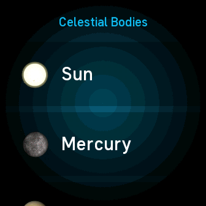
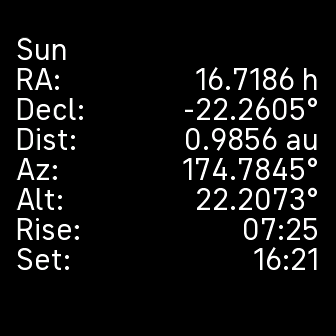

# fitbit-planets
This application calculates the positions of the planets and celestial bodies including the sun and moon.  It provides right ascension and declianation values as well as distance, azimuth, altitude and the rise and set time of the body.  The calculations are thanks to the work of [Paul Schlyter](http://stjarnhimlen.se/english.html) and his pages on calculating planetary positions.

There are two types of pages that can be found on the app.  The first is a menu listing of all the celestial body, and the second is the data from the celestial body.  This first example is the menu.



And the second is an example of the data from the celestial body.  The sun in this case.



## Build Instructions
The following packages are needed to build the application.

### Software required to build a fitbit app
The following version is the one I used to build the app.  The instructions on how to set it up is avialable at the fitbit [developer](https://dev.fitbit.com/getting-started/) website.

```
$ node --version
v14.21.3
```

To install node 14 follow the instructions from the developer website, in short run.

```
nvm install 14
nvm alias default 14
```

### Instructions on how to build this fitbit app and install it
Install node  by running the above commands, then clone the fitbit-planets repository.  Change directory to the fitbit-planets directory and use to install the node_modules needed and to build the app.  Run

```
cd fitbit-planets
cd app && yarn install && yarn build
```
You should get something like this from the previous two commands.
```
yarn install v1.22.19
info No lockfile found.
[1/4] Resolving packages...
warning @fitbit/sdk > magic-string > sourcemap-codec@1.4.8: Please use @jridgewell/sourcemap-codec instead
warning @fitbit/sdk > @rollup/plugin-commonjs > magic-string > sourcemap-codec@1.4.8: Please use @jridgewell/sourcemap-codec instead
warning @fitbit/sdk-cli > @moleculer/vorpal > babel-polyfill > core-js@2.6.12: core-js@<3.23.3 is no longer maintained and not recommended for usage due to the number of issues. Because of the V8 engine whims, feature detection in old core-js versions could cause a slowdown up to 100x even if nothing is polyfilled. Some versions have web compatibility issues. Please, upgrade your dependencies to the actual version of core-js.
warning @fitbit/sdk-cli > @moleculer/vorpal > babel-polyfill > babel-runtime > core-js@2.6.12: core-js@<3.23.3 is no longer maintained and not recommended for usage due to the number of issues. Because of the V8 engine whims, feature detection in old core-js versions could cause a slowdown up to 100x even if nothing is polyfilled. Some versions have web compatibility issues. Please, upgrade your dependencies to the actual version of core-js.
[2/4] Fetching packages...
[3/4] Linking dependencies...
[4/4] Building fresh packages...
success Saved lockfile.
Done in 11.74s.
yarn run v1.22.19
$ fitbit-build
[12:38:35][warn][build] Targeting proposed API may cause your app to behave unexpectedly. Use only when needed for development or QA.
[12:38:35][warn][settings] This project is being built without a settings component. Create a file named settings/index.tsx, settings/index.ts, settings/index.jsx or settings/index.js to add a settings component to your project.
[12:38:38][info][app] Building app for Fitbit Sense 2
[12:38:38][info][app] Building app for Fitbit Versa 4
[12:38:38][info][companion] Building companion
[12:38:39][info][build] App UUID: 4b678716-7e8e-4259-893d-d4b026e3c4a5, BuildID: 0x09b6d1b419367701
Done in 3.98s.
```
Setup the developer bridge in the fitbit app on your phone.  Select Account, device (In my case Sense 2), Developer Menu and toggle the switch Developer Bridge.  On your watch, select Settings, Developer Bridge and Turn on USB debugging.  This will require a reboot of the watch.  Then execute the the next code example.
```
export FITBIT_QA_COMMANDS=1
export FITBIT_DEVBRIDGE_DUMP=1
yarn debug
```
You should get output similar to the following section.
```
yarn run v1.22.19
$ fitbit
Logged in as Chris Gorman <chrisjohgorman@gmail.com>
fitbit$
```
Now connect your phone and device.  Then run build-and-install to sideload the app to your watch.
```
fitbit$ connect phone
Auto-connecting only known phone: Samsung SM-A520W
fitbit$ connect device
Auto-connecting only known device: Sense 2
fitbit$ build-and-install
```
You should get output similar to the following.
```
npm WARN lifecycle The node binary used for scripts is /tmp/yarn--1701711600584-0.7858965634983297/node but npm is using /home/chris/.nvm/versions/node/v14.21.3/bin/node itself. Use the `--scripts-prepend-node-path` option to include the path for the node binary npm was executed with.

> fitbit-planets@0.1.1 build /home/chris/src/javascript/fitbit-planets
> fitbit-build

[12:41:59][warn][build] Targeting proposed API may cause your app to behave unexpectedly. Use only when needed for development or QA.
[12:41:59][warn][settings] This project is being built without a settings component. Create a file named settings/index.tsx, settings/index.ts, settings/index.jsx or settings/index.js to add a settings component to your project.
[12:42:02][info][app] Building app for Fitbit Sense 2
[12:42:02][info][app] Building app for Fitbit Versa 4
[12:42:02][info][companion] Building companion
[12:42:03][info][build] App UUID: 4b678716-7e8e-4259-893d-d4b026e3c4a5, BuildID: 0x0c7f8d7e75148ce9
No app package specified. Using default ./build/app.fba.
Loaded appID:4b678716-7e8e-4259-893d-d4b026e3c4a5 buildID:0x0c7f8d7e75148ce9
App install complete (full)
Companion install complete (full)
Launching app
```

For further build and install instructions see the [Command Line Interface](https://dev.fitbit.com/build/guides/command-line-interface/) at dev.fitbit.com.

## License

This project has two licenses.  The [library](common/planetCoordinates.js) is licensed under the GNU Lesser General Public License 3.0 - see the [gpl-lgpl-v3.0.md](gnu-lgpl-v3.0.md) file for details.  The rest of the app was pulled shamelessly from [sdk-app-demo](https://github.com/Fitbit/sdk-app-demo) and from [sdk=weather-clock](https://github.com/Fitbit/sdk-weather-clock) both by Jon Barlow and is covered under the [MIT license](mit.md).
